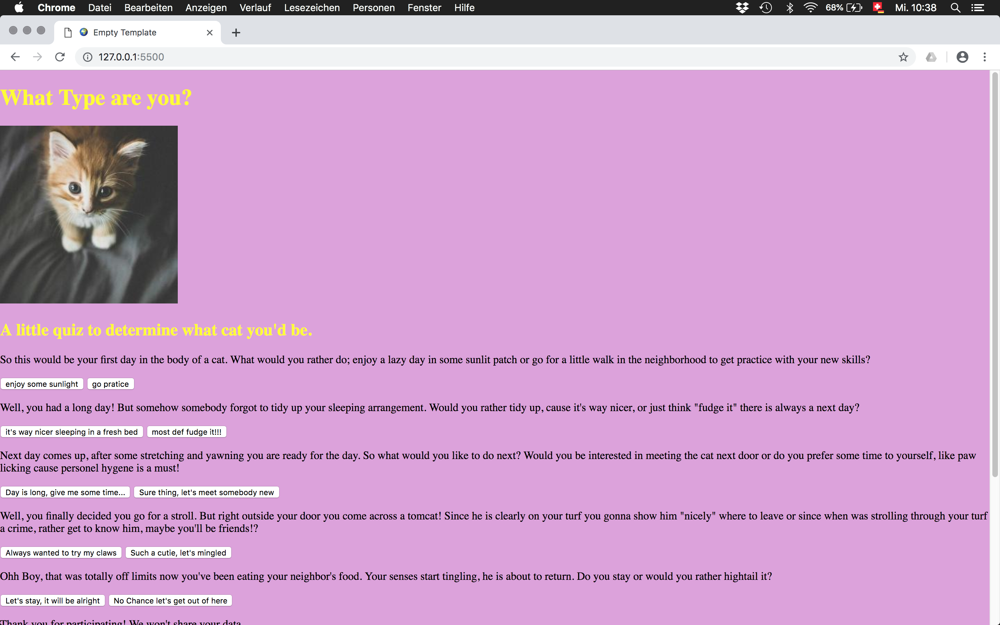

# Workshop Documentation

The workshop «Copy It Right! On sharing, caring, data and network politics» was held at the Institute Integrative Design Masterstudio in Basel from March 27th to 29th 2019. 

The students from the masterclass downloaded all there Facebook data in JSON format and learned the basic coding skills to play around with them. 

The goal was to pick one piece of data and visualize it. The students where free in choosing an appropriate method and encouraged to transfer the topic into there individual praxis. Therefore the results range from printed posters, exhibition concepts, interventions in public space to performance art. Nevertheless many students where interested in coding as a tool and created websites and visualizations trough the use of the [P5JS Javascript library](http://p5js.org/), HTML and CSS. Since many of the works include personal data of the students, we decided to not share the source code here.

#### Some thoughts and discoveries collected during the workshop
* The JSON data is ugly and hard to access, all data is fractured into pieces. Therefore it's hard to get an overview and real understanding. This makes an intervention trough design meaningful. The designer can become a translator.
* Looking at the private messages is like browsing trough an old diary or a bunch of old love letters. On the one hand it's fun and interesting, on the other hand it's horrible to see that all of this old stuff is still available.
* Compared to paper, the data does not rot. While we grow old, the data stays the same. What about the right to forget?
* It would be nice to send out all of these messages as physical letters.
* Ip adresses from afrika get ignored by the service [ipapi](https://ipapi.co/). The service puts his focus on the western world.
* Written language totally differs from the spoken one. How do you pronounce 😅 and 😶?
* Psychological question can be camouflaged behind cute cat pictures.
* The world of coding and digital technology is not a world out of reach. We should not be afraid of getting in touch with it. We should not underestimate our capacities to understand it.

## Collection of works

Collection of uploaded facebook contacts. This selfmade phonebook alows for direct facetime calls. By Laura Antonietti.

Website which creates a wikipedia link for every personal ads-interest. Since he didn't knew about many of the listed terms, Selim decided to create this website to learn about what Facebook thinks he must be interested in. By Selim Abdullah Buldu.

Exhibition concept for displaying personal messages, by Catarina Cardinale, Stella Meyer and Alessandra Di Santo.

A website based on `advertisers_who_uploaded_a_contact_list_with_your_information.json`. Based on the brands, the class had to guess who's information it is. By Linda Bäuble, Max Erhart and Hanchen.

A website based in facbook likes data, by Fadeeva Ekaterina.

Video still displaying facbook log in locations over time, by Alena Gaiser and Carolin Reinert.

Visual experiments with P5JS, by Wanda Gysin.

A quiz website where you can find out what type of cat you are. Every question is based on the OCEAN model from psychographics, but hidden behind the cuteness of the cat scenario. The same model was used by Camrbidge Analytica. By Tobias Jenni.

Video still. The students mapped there log in locations on a projection. Helge then tried to touch all the spots (yellow circles) at the wall in real time and space. Trough this they tried to actually travel to those spaces. Because many of there log in locations came from servers in countries they never travelled to. By Kihako Narisawa and Helge Brackmann.

Posters based on companies who got some profile information from the students. Custom font created out of brand logos. By Valerie Pohlmann and Robert Zumkeller.

Public space intervention to make the students private messages from facebook public. There is evidence that those messages are by no means private. As it turned out, Facebook shared this messages with companies like Amazon and Netflix. In there concept these messages therefore can be spoke out loud at swiss trainstations. By Jil Thieringer, Talia Uslu and Anniina Veijalainen.

 

