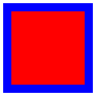

# P5.js Introduction ✌️

## Folder Structure

Starter template *empty_template* folder structure:

```
empty_template //folder to open in editor, can be renamed
│   index.html //the file shown by the browser
│   sketch.js //this is where your p5.js code will go!
│
└─── assets //the files required by the website
     │  
     └─── css
     │   └─── style.css  //stylesheet for this website
     └─── p5js //p5js library

```

## P5.js

Let's look at the basics of your P5.js sketch. This is the file `sketch.js` inside your project folder.

### 1. Basic functions:

Every P5.js sketch needs the following two functions.
This one will execute once at the beginning. You create your canvas here and need to tell it how big it is:

```
function setup() {
  var cnv = createCanvas(720, 400); // how big your sketch should be
  cnv.parent('p5-sketch-holder'); // where to place your sketch in the index.html document
}
```

This one executes 60 times a second (loop). This loop makes it possible, that your drawing is changing.

```
function draw() {
  background(0, 0, 255); // blue background
}
```
### 2. Coordinate system and units of measure:

In P5.js you work with a `x` and `y` axis. `x` is horizontal or the "width", `y` is vertical or the "height" of an object. Usually you work with numbers which equal to pixel (e.g. `100` is 100px on your screen). You can also use `%` instead of pixel. For working with retina displays it's usefull to add `pixelDensity(1);` to the setup. 

```
createCanvas(720, 400); //canvas is 720 x 400 px
pixelDensity(1); //takes care of hi-res retina displays
```

```
rect(10, 20, 50, 50); //rectangle is positioned at x: 10, y: 20 and 50 x 50 px
```

### 3. Primitiv shapes
There are different shapes predefined. Including rectangles, circles, triangles and more. [For a full reference visit the p5.js website](https://p5js.org/examples/form-shape-primitives.html). Depending on there shape they need different arguments:

```
rect(x, y, width, height);
ellipse(x, y, width, height);
line(x1, y1, x2, y2)
triangle(x1, y1, x2, y2, x3, y3)
```

You can give color and stroke. If you don't want a stroke write: `noStroke();`

```
fill(255, 0, 0);
stroke(0, 0, 255);
strokeWeight(5);
rect(10, 20, 50, 50);
```
The code above results in: 



### 4. Color

P5.js uses the RGB color mode by default. Every color needs therefore 3 arguments: `fill(red, green, blue)`. The values range from 0 to 255. If you only write one argument it will result in grayscale. 

```
fill(0) // black
fill(255) // white
``` 

You can also use different color modes like HEX, HSB or HSL or RGBA (transparency). [For a full reference visit the p5.js website](https://p5js.org/reference/#/p5/color).

### 5. Variables

To be more flexible you can use variables. They are key elements of Javascript.

```
var myVariableName; // declare a variable
var size = 100; // declare a variable and assign a value
```
Now you can use this variable (and it's value) in the code: `rect(0, 0, size, size);` Awesome! 🎉

There are also built in variable like `mouseX`, `mouseY` as well as canvas `width` and `height`. 

### 6.1. Datatypes

There are a few datatype to know about. 🚨 **Usually we use all of them in combinations with variables!**

```
var a = 100 // round number
var b = 1.23456 // floating number
var c = "I am a setence" // string
var d = color('#0f0'); // color

```

### 6.2. Array
You can think of the array as a bucket full of things. They are very usefull, practically every data out in the web (e.g. your facebook likes) is safed as array data type. **Attention: the array index always starts at 0**

```
var myArray = [10, 20, 30, 40]; // array data type: a list of things.

// to look into the list (array)
myArray[0] // gives you 10
myArray[1] // gives you 20
myArray[2] // gives you 30
myArray[3] // gives you 40

myArray[4] // gives you an error!

```

### 7. Console

Every browser has a console. You can output data in the console to see problems in the code by writting `console.log(myVariable)`. If you log an array it will show you the full list. The console is **super helpfull**, never underestimate the power of the console 💪.

### 8. Conditionals: if/else
Sometimes you only want to execute code if a certain condition is true. That's where you can work with if/else. This is a key concept of programming.

```
var number = 100;

if(number == 100) {
  fill(0);
} else {
  fill(255);
}

rect(0, 0, 100, 100);
``` 
This result in a black rectangle because `number` is equal to `100`. Have you seen the `==`? That's an important detail! If you would use only one `=` you would assign a new value to `number` instead of comparing it. 

### 9. For loop

If you want to handle many similar things at once, the "for loop" is the weapon of choice. `var i` is a counter which usually starts at `0`. As long as `i` is smaller than `100` the code inside the `{}` gets executed. `i = i + 1` indicates how big the counting steps are.

```
for (var i = 0; i < 100; i = i + 1) {
  rect(0, 0, 100, 100);
}
```
This code draws 100 rectangles on the same position. Cool, right? Keep reading!

### 10. Random

Usually you need a bit of random to make you code spicy 🔥 at some point. This outputs you a random number between 0 and 100: `random(0, 100);`. Trough this the code from above makes much more sense:

```
for (var i = 0; i < 100; i = i + 1) {
  var x = random(0, width);
  var y = random(0, height);
  rect(x, y, 100, 100);
}
```


## Ressources
We can encourage you to check out the following resources:

[Introduction Video Tutorial](https://www.youtube.com/watch?v=8j0UDiN7my4&t=10s)

[Daniel Shiffman - creative coding guru](https://shiffman.net/)

[Learn more from the P5.js website!](https://p5js.org/learn/)

[Official P5.js Forum](https://discourse.processing.org/c/p5js)

[ml5.js - Friendly Machine Learning for the Web.](https://ml5js.org/)

[P5.js subreddit](https://www.reddit.com/r/p5js/)
