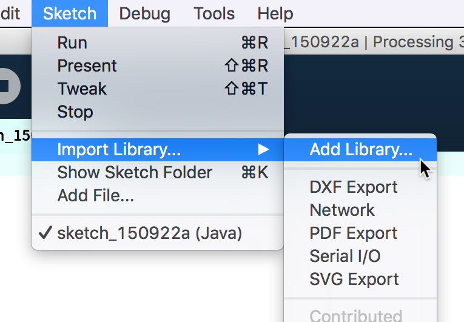

# Processing Workshop 
30.4. – 2.5.2019 @ HGK Hyperwerk, Mark Iandovka & Max Frischknecht, [basel.codes](https://basel.codes/)

## Program

### Tuesday, 30.4.

* Introduction to the course, expectations & experince
* Processing software environment (console, errors, sketchbook, examples etc)


* ***Programming basics I***
	* Program structure
	* Coordinate system
	* Shapes
	* Colors
	* Basic interactivity 

* ***Programming basics  II***
	*  Variables && datatypes
	*  Random 
	*  Utilities
* *Lunch*
* ***Programing basics III***
	* Daniel Shiffman 
	* if/else
	* Loops
	* Advanced interactivity
	* Images
	* Tweak mode
* ***Outlook day 2***
	* Introduction libraries 

### Wednesday, 01.05.
* ***Individual Work***

### Thursday, 02.05.
* *Recap of day 1*
* *Individual work with support*
* *Ad hoc tutorials to requested topics*
* *5 min presentation each*
* *Final discussion & feedback round*

## Day 1 – Basics Cheatsheet
Download the Processing software here: [https://processing.org](https://processing.org)

See the full reference here: [https://processing.org/reference/](https://processing.org/reference/)


### Program Structure
Every Processing sketch needs the following two functions. `setup` will execute once at the beginning. Here you can define the size of your sketch.


```
void setup(){
  size(200, 200);
}
```

`draw` executes 60 times a second. It's a loop which makes it possible, that your drawing is changing over time.

```
void draw(){
  // drawing something awesome here
}
```

### Coordinate System and Units of Measure:

In Processing you work with a `x` and `y` axis. `x` is horizontal or the "width", `y` is vertical or the "height" of an object. Usually you work with numbers which equal to pixel (e.g. `100` is 100px on your screen). You can also use a relative unit instead of pixel. For example trough calculation `x = width * 1.5`. If the `width` changes, `x` is also changing.

```
size(720, 400); //sketch is 720 x 400 px
```

```
rect(10, 20, 50, 50); //rectangle is positioned at x: 10, y: 20 and 50 x 50 px
```


### Shape Primitives
There are different shapes predefined. Including rectangles, circles, triangles and more. Checkout the shapes [here.](https://processing.org/examples/shapeprimitives.html) Depending on there shape they need different arguments:

```
rect(x, y, width, height);
ellipse(x, y, width, height);
line(x1, y1, x2, y2);
triangle(x1, y1, x2, y2, x3, y3);
```


### Colors
Processing uses the RGB color mode by default. Every color needs therefore 3 arguments: `fill(red, green, blue)`. The values range from 0 to 255. If you only write one argument it will result in grayscale. 

```
fill(0); // black
fill(255); // white
fill(255, 0, 0); // red
background(255); // white background
``` 

You can add, remove or change the stroke (= border of the shape) with:

```
stroke(255, 0, 0); // red stroke
strokeWeight(5); // 5px stroke
noStroke(); // no stroke
```


### Basic Interactivity

You can easily use your mouse position with `mouseX` and `mouseY`.
`rect(mouseX, mouseY, mouseX/3, mouseY/3);`

### Variables && Datatypes

```
int numA = 100; // integer number
float numB = 12.22 // float point number
String str1 = "CCCP"; // a string (word, sentence)
color c = color(255, 204, 0);  // Define color 'c'
boolean a = false; // can be true or false
```
Additional datatypes which we will cover later on.

```
PImage img; // an image
int[] numbersList = { 90, 150, 30 };  // a list of integer numbers
float[] numbersList2 = { 1.3, 12.5, 9.3 };  // a list of float point numbers
```
Variables always have a scope. If you define them at the top they become global, which means you can use them everywhere. If you define them inside a function like `setup` or `draw` they are only available inside this function.

```
int a = 10:

void setup(){
  // a is available
  int b = 20; // b is ONLY available in setup
}

void draw() {
  // a is available
  // b is NOT available in draw
}
```


### Random
Usually you need a bit of random to make you code spicy 🔥 at some point. This outputs you a random number between 0 and 100: `random(0, 100);`.

This outputs a random float point number like `97.3`. You can convert it into a `int` with `int(random(0, 100))` which would result in `97`. The number will always be rounded down.

### Modulo (%)
Sometimes you need to bring a number into a certain range, for example when drawing or when working with colors. Other uses including helping make sure something happens every x-iteration.

Modulo is a function that returns the remainder of a division of 2 input numbers (int or float). So 5%4 is 1, since the remainder when doing 5/4 is 1.

### Utilities
You can uncomment a code so it will no be executed. It's a good habit to briefly explain pieces of your code using comments. This helps you and others to understand you code later. 

```
// one lines will be commented out

/*
  multiple lines will be commented out
  multiple lines will be commented out
*/
```
You can talk to your console by using `print();` and `println();` (prints a line)

### If / Else
If a condition is true, a piece of code gets executed. This is a fundamental progaming concept.

```
boolean iWantBlack = true;

if(iWantBlack) {
  fill(0);
} else {
  fill(255);
}

rect(0, 0, 100, 100);
``` 
This result in a black rectangle because `iWantBlack ` is set to `true`. 

### Loops
If you want to handle many similar things at once, the "for loop" is the weapon of choice. `int i` is a counter which usually starts at `0`. As long as `i` is smaller than `80` the code inside the `{}` gets executed. `i = i + 5` indicates how big the counting steps are.

```
for (int i = 0; i < 80; i = i+5) {
  line(30, i, 80, i);
}
```

instead of `i = i + 5` you can also write `i+=5` or `i++` (same as `i + i + 1`)


### Advanced Interactivity
#### Key recognition
Detect if a key is pressed

```
void keyPressed() {
  if (key == 'y' || key == 'Y') {
    // do something when y is pressed
  }
}
```

The variable `keyCode` is used to detect special keys such as the arrow keys (UP, DOWN, LEFT, and RIGHT) as well as ALT, CONTROL, and SHIFT. 

```
void keyPressed() {
  if (key == CODED) {
    if (keyCode == UP) {
      fill(255);
    } else if (keyCode == DOWN) {
      fill(0);
    } 
  } 
}
```

#### Save an image
```
void keyPressed() {
  if (key == 's' || key == 'S') {
    saveFrame("mysavedimage_##.png");
    println("Saved yo!");
  }
}
```


### Images
```
PImage img;

void setup() {
  // Images must be in the "data" directory to load correctly
  img = loadImage("myImage.jpg");
}

void draw() {
  image(img, 0, 0);
}
```

### Tweak Mode
You can live-edit your code with the tweak mode! `cmd/ctrl + shift + T` 


### Sketchbook
Your Processing software also has a "sketchbook" where you can collect your sketches. You can define the location of this folder under `Settings -> sketchbook path`. By default the folder is located in your `documents` folder. You can open the sketchbook via `File -> Sketchbook` or `cmd/ctrl + shift + K`


### Examples
Take a look under `File -> examples` and here [https://processing.org/examples/](https://processing.org/examples/).


## Day 2 – Individual Work && Mentoring

### Libraries 
We encourage you to work with libraries to expand the possibilities of processing!



### Sound

[https://processing.org/reference/libraries/sound/index.html](https://processing.org/reference/libraries/sound/index.html)

Processing can be used both to recognize sound and respond to it and to generate sound using the sound library.

### Webcam && Video

[https://processing.org/reference/libraries/video/index.html](https://processing.org/reference/libraries/video/index.html)

The Video library plays movie files and captures video data from a camera. Video can be captured from USB Cameras, IEEE 1394 (Firewire) Cameras, or Video Cards with composite or S-video input devices connected to the computer. Movies can be loaded from files located on your computer or anywhere on the Internet. 

### Open CV / Computer Vision

[https://github.com/atduskgreg/opencv-processing](https://github.com/atduskgreg/opencv-processing)

There is a Processing version of the popular computer vision library OpenCV.

### Network Visualization: Carnivore

[http://r-s-g.org/carnivore/](http://r-s-g.org/carnivore/)

Carnivore is a Processing library that allows you to perform surveillance on data networks. Carnivore listens to Internet traffic (email, web surfing, etc.) on a specific local network. Using Processing you are able to animate, diagnose, or interpret the network traffic in any way you wish. Further reading can be found [here](https://processing.org/tutorials/)

### User Interface: ControlP5

[http://www.sojamo.de/libraries/controlP5/](http://www.sojamo.de/libraries/controlP5/)

ControlP5 is a library to build a graphical user interface on top of your processing sketch include Sliders, Buttons, Toggles, Knobs, Textfields, RadioButtons, Checkboxes amongst others and can be easily added to a processing sketch.

### Web: P5.js

[https://p5js.org/](https://p5js.org/)

P5.js is a Javascript library with the same approach like Processing. If you want to transfer your sketch into web, this is the way to go. We also did a workshop on this topic, you can have a look here [P5JS For Beginners](https://github.com/baselcodes/PCD2019/tree/master/Workshops/P5JS%20for%20Beginners)


### Api / Data with P5.js

Using P5.js, the javascipt based library inspired by Processing, you can easily work with live data. Check out Dan Shiffmans tutorial if below.

[https://www.youtube.com/playlist?list=PLRqwX-V7Uu6a-SQiI4RtIwuOrLJGnel0r](https://www.youtube.com/playlist?list=PLRqwX-V7Uu6a-SQiI4RtIwuOrLJGnel0r)


## Resources

[Processing Reference](https://processing.org/reference/)

[Processing Forum](https://discourse.processing.org/)

[Hello Processing! Introduction Tutorial](https://hello.processing.org/) 

[Daniel Shiffman on Youtube](https://www.youtube.com/user/shiffman)

[Nature of Code, book, example collection, Daniel Shiffman](https://natureofcode.com/)

[Learning Processing, book, example collection, Daniel Shiffman](http://learningprocessing.com/)

[The Processing Handbook, Casey Reas & Ben Fry](https://processing.org/handbook/)

[Form + Code in Design, Art & Architecture, book, example collection](http://formandcode.com/)

[Generative Gestaltung, book, example collection](http://www.generative-gestaltung.de/)

[Works by Casey Reas](http://reas.com/)

[Creative Applications Blog](http://www.creativeapplications.net/)

[Basel.codes website](https://basel.codes/)
