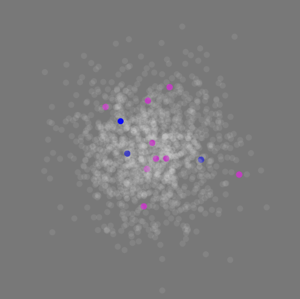

## Sketch for Network Visualization

A simple wifi interception based on the Carnivore Library
by Max Frischknecht, 2018

Carnivore is a Processing library that allows you to perform surveillance on data networks. Carnivore listens to Internet traffic (email, web surfing, etc.) on a specific local network. Using Processing you are able to animate, diagnose, or interpret the network traffic in any way you wish. Further reading can be found [here](https://processing.org/tutorials/)

Library:
[http://r-s-g.org/carnivore](http://r-s-g.org/carnivore)

List of TCP Ports:
[https://en.wikipedia.org/wiki/List_of_TCP_and_UDP_port_numbers](https://en.wikipedia.org/wiki/List_of_TCP_and_UDP_port_numbers)

+ Windows:  first install winpcap (http://winpcap.org)
+ Mac:      first open a Terminal and execute this commmand: sudo chmod 777 /dev/bpf*
            (must be done each time you reboot your mac)

