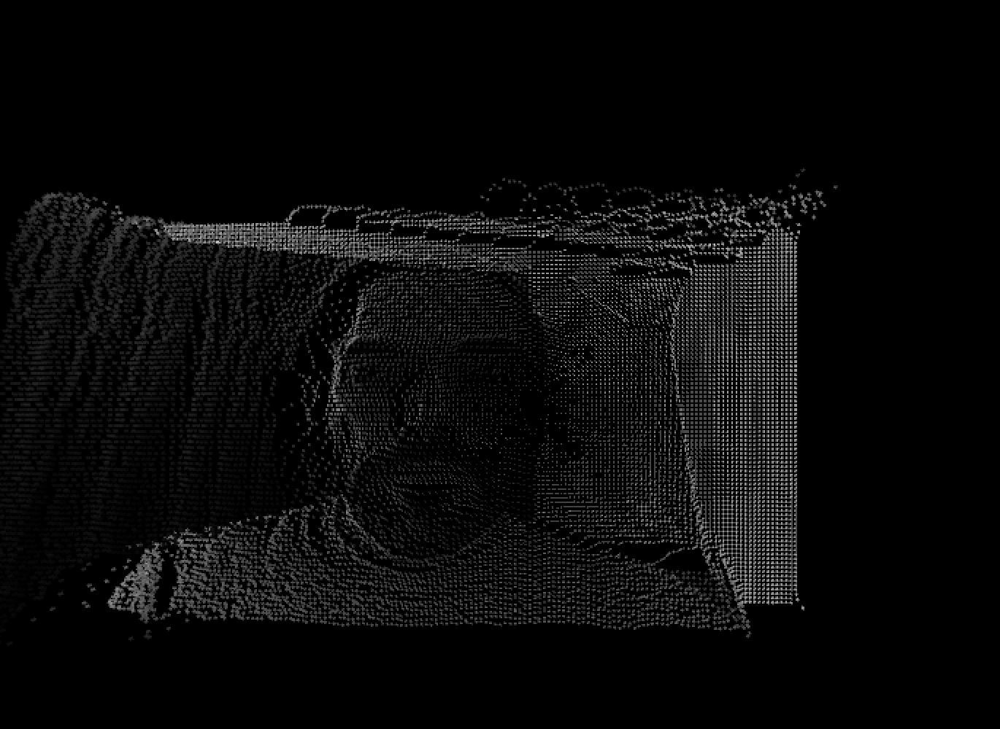

## Transform: Transcoded Landscape

Based on the example by the Form + Code Book
[http://formandcode.com/code-examples/transform-landscape](http://formandcode.com/code-examples/transform-landscape)

Also check out this by Dan Shiffman working with a kinect:

[12.3: Raw Depth Data - Point Clouds and Thresholds - Kinect and Processing Tutorial](https://www.youtube.com/watch?v=E1eIg54clGo)

